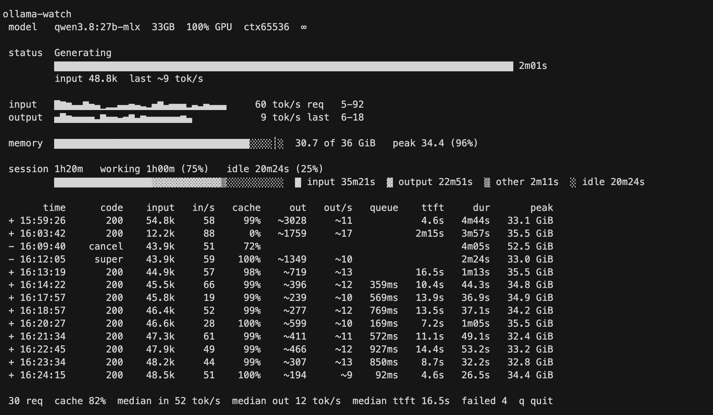

<div align="center">

# ollama-watch

*Terminal observability for local model status via Ollama*

[](./pyproject.toml)
[](./src/ollama_watch)
[](./LICENSE.md)

**Live prefill and decode progress from Ollama's runner.**

**Standard library only. No dependencies.**



[Dashboard](#dashboard) · [Library](#as-a-library) · [Quickstart](#quickstart) · [Tests](#tests) · [Contributing](#contributing)

</div>

---

## Contents

- [Quickstart](#quickstart)
- [Dashboard](#dashboard)
  - [Session Accounting](#session-accounting)
  - [Time To First Token](#time-to-first-token)
  - [Sparklines](#sparklines)
- [As A Library](#as-a-library)
- [Tests](#tests)
- [Contributing](#contributing)

---

## Quickstart

```bash
uv tool install .          # or: pipx install .
```

Run it:

```bash
ollama-watch
```

With a historical log + pinned bottom current state:

```text
✔ 16:23:34 200 32.243998125s | input 48.2k cached 47.9k processed 343 @ 44 tok/s (7.8s) | out ~307 @ ~13 tok/s (23.6s) mtp_accept_rate 0.79 | peak 32.78 GiB
✔ 16:24:15 200 26.539759625s | input 48.5k cached 48.2k processed 231 @ 51 tok/s (4.5s) | out ~194 @ ~9 tok/s (21.9s) mtp_accept_rate 0.80 | peak 34.38 GiB
✔ 16:26:54 200 2m27s | input 48.8k cached 48.5k processed 282 @ 60 tok/s (4.7s) | out ~1632 @ ~11 tok/s (2m21s) mtp_accept_rate 0.67 | peak 32.83 GiB

[qwen3.8:27b-mlx 34GB 100%GPU ctx65536 ∞] Processing input ███████████████████████████░  99.3% 48.7k/49.1k cached 48.7k
```

> `Ctrl+C` prints a session summary: median input and output rates, total tokens, cache hit share, and failure count.

Or run it straight from a clone:

```bash
PYTHONPATH=src python3 -m ollama_watch.cli
```

### Options

```bash
ollama-watch                       # follow live, one status line
ollama-watch -d                    # full-screen dashboard
ollama-watch --replay              # replay this log's history, then follow
ollama-watch --replay --no-follow  # history + summary, then exit
ollama-watch --log /path/to/server.log --host 127.0.0.1:11434
ollama-watch --no-server           # skip /api/ps (no model details in the header)
```

---

## Dashboard

`ollama-watch -d` gives a full-screen view. `q` quits.

```text
ollama-watch
 model   qwen3.8:27b-mlx  33GB  100% GPU  ctx65536  ∞

 status  Generating
         ████████████████████████████████████████████████████████████████████████████████ 2m01s
         input 48.8k  last ~9 tok/s

 input   █▇▆▄▄▇▅▄▁▂▂▄▄▅▄▃▂▅▇▄▅▅▅▂▄▃▅▄▄▄     60 tok/s req   5-92
 output  ▅█▆▅▅▅▅▃▇▅▅▄▅▇▄▆▅▅▅▅▅▅▆▄            9 tok/s last  6-18

 memory  ██████████████████████████████████░░░░┊░  30.7 of 36 GiB   peak 34.4 (96%)

 session 1h20m   working 1h00m (75%)   idle 20m24s (25%)
         █████████████████▓▓▓▓▓▓▓▓▓▓▓▓▒░░░░░░░░░░  █ input 35m21s  ▓ output 22m51s  ▒ other 2m11s  ░ idle 20m24s

       time      code    input   in/s   cache     out   out/s   queue    ttft     dur       peak
 + 15:59:26       200    54.8k     58     99%   ~3028     ~11            4.6s   4m44s   33.1 GiB
 + 16:03:42       200    12.2k     88      0%   ~1759     ~17           2m15s   3m57s   35.5 GiB
 - 16:09:40    cancel    43.9k     51     72%                                   4m05s   52.5 GiB
 - 16:12:05     super    43.9k     59    100%   ~1349     ~10                   2m24s   33.0 GiB
 + 16:13:19       200    44.9k     57     98%    ~719     ~13           16.5s   1m13s   35.5 GiB
 + 16:14:22       200    45.5k     66     99%    ~396     ~12   359ms   10.4s   44.3s   34.8 GiB
 + 16:17:57       200    45.8k     19     99%    ~239     ~10   569ms   13.9s   36.9s   34.9 GiB
 + 16:18:57       200    46.4k     52     99%    ~277     ~12   769ms   13.5s   37.1s   34.2 GiB
 + 16:20:27       200    46.6k     28    100%    ~599     ~10   169ms    7.2s   1m05s   35.5 GiB
 + 16:21:34       200    47.3k     61     99%    ~411     ~11   572ms   11.1s   49.1s   32.4 GiB
 + 16:22:45       200    47.9k     49     99%    ~466     ~12   927ms   14.4s   53.2s   33.2 GiB
 + 16:23:34       200    48.2k     44     99%    ~307     ~13   850ms    8.7s   32.2s   32.8 GiB
 + 16:24:15       200    48.5k     51    100%    ~194      ~9    92ms    4.6s   26.5s   34.4 GiB

 30 req  cache 82%  median in 52 tok/s  median out 12 tok/s  median ttft 16.5s  failed 4  q quit
```

### Session Accounting

The `session` panel splits the wall clock into where it was spent: model-work time, idle time, etc.

Working time splits again into processing input, generating output, and the remainder of a request that is neither (queueing, tokenising, templating).

### Time To First Token

Ollama's Gin times the whole HTTP handler, so a request's arrival is `end - duration`.

From that: `queue` is arrival until the runner started work, and `ttft` is arrival until input processing finished - the wait before the first token can appear. While a request is in flight the live panel shows `ttft so far`, which is a lower bound, since the figure is only final once the request ends.

### Sparklines

Sparklines display recent history. One bar per **finished** request, **oldest on the left, newest on the right**.

The figure to the right of each sparkline is the min-max rate across its bars. Sparklines are padded to a fixed width so that figure stays in one column even though the two rows rarely hold the same number of bars.

Also, each sparkline is scaled to its own peak.

---

## As A Library

Everything the CLI shows is available programmatically, so you can build your own CLI, your own dashboard, or feed the numbers into something else entirely — a status bar, a progress widget in your own Ollama client, a metrics exporter, etc.

`watch()` is the whole pipeline as a generator. It yields an `Update` whenever anything changes:

```python
from ollama_watch import Phase, watch

for update in watch():
    state = update.state
    if state.phase is Phase.PREFILL:
        print(f"{state.fraction:.0%} of {state.prompt_tokens}, eta {state.eta_s:.0f}s")
    for receipt in update.receipts:
        print(receipt.status, receipt.prompt_tokens, receipt.decode_rate)
```

A twenty-line progress bar, which is roughly what `ollama-watch` without the dashboard is:

```python
from ollama_watch import Phase, watch

last = None
for update in watch():
    state = update.state
    if state.phase is Phase.PREFILL and state.fraction != last:
        last = state.fraction
        filled = int(state.fraction * 40)
        eta = f"eta {state.eta_s:.0f}s" if state.eta_s else ""
        print(f"\r[{'#' * filled:<40}] {state.fraction:.0%} {eta}", end="", flush=True)
    for receipt in update.receipts:
        last = None
        mark = "ok" if receipt.ok else receipt.status
        ttft = f"ttft {receipt.ttft_s:.0f}s" if receipt.ttft_s else "ttft unknown"
        print(f"\r{mark} {receipt.prompt_tokens} in, {ttft}")
```

---

## Tests

```bash
uv run --with pytest python -m pytest
```

---

## Contributing

Found a bug? Have an idea? PRs welcome.

1. Fork it
2. Create your feature branch
3. Write tests
4. Submit a PR
